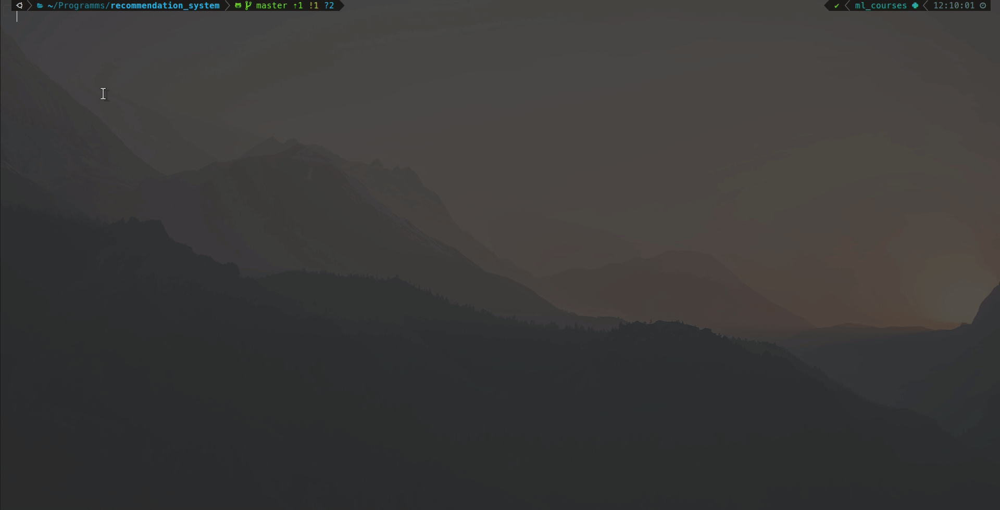
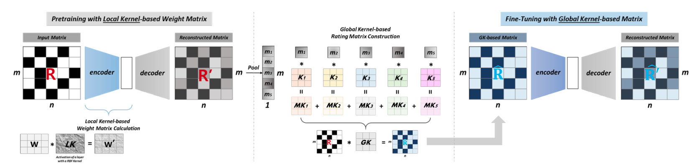

# Film recommendation system
First steps in recommendation systems area


## Description
This repository implemets the recomendation system based on the `MovieLens-100k` dataset. The repository contains the custom Graph Neural Networks trained on the dataset, benchmark model implementation, and simple inference script

> Note: the custom GNN is still under development, so currenly only the benchmark model is implemented. 


## Structure
```bash
├── benchmark                 # Implementation of benchmarking
│   └── benchmark_models
│      └── GLocal_K.py        # Benchmark model training & evaluation
├── data                      # Directory for the data
├── models                    # Model weights
│   └── glocal_k
├── notebooks                 # Different exploration notebooks
│   ├── 01_data_visualization.ipynb    
│   ├── 02_handcrafted_gnn.ipynb
│   └── 03_models_comparision.ipynb
├── reports                   # Reports & Figures
│   └── figures
└──── src                     # Source code
    ├── data               
    │   ├── load_dataset.py   # Scripts for loading the datasets
    └── inference.py          # Inference script
```

## Models
### Benchmark model -- GLocal_K
The benchmark model is "GLocal_K" ([paper](https://arxiv.org/pdf/2108.12184.pdf)). The model is, in fact, autoencoder. However, the trick is in training the model: Firstly, an auto encoder is pretrained with the local kernelised weight matrix, which transforms the data from one space into the feature space by using a 2d-RBF kernel. Then, the pre-trained auto encoder is fine-tuned with the rating matrix, produced by a convolution-based global kernel, which captures the 
characteristics of each item. This results in quite decent performance (Fig. 4).

<center>
    <figure>
    
    <figcaption>Figure 4. The schematic overview of Glocal_K architecture (source: [paper](https://arxiv.org/pdf/2108.12184.pdf)). </figcaption>
    </figure>
</center>

## Installation
```bash
git push https://github.com/domrachev03/text_detoxification
```
and make sure to install [dependencies](https://github.com/domrachev03/gnn_recommendation_system/blob/master/environment.yml).

## Dependencies
The main dependencies are:
1. `Pytorch`
2. `Pytorch-Graphical`
3. Utilities: `unzip`, `argparse`

For the convenience, all the dependencies are provided in the `requirements.txt` and `environment.yml`.

## Utilization


## Acknowledgement
I would like to thanks the team of Practical Machine Learning and Deep Learning course for such a great opportunity to explore the world of Natural Language Processing. Special thanks to Vladimir Ivanov and Maxim Evgragov for tutorship and answering my (usually stupid) questions.