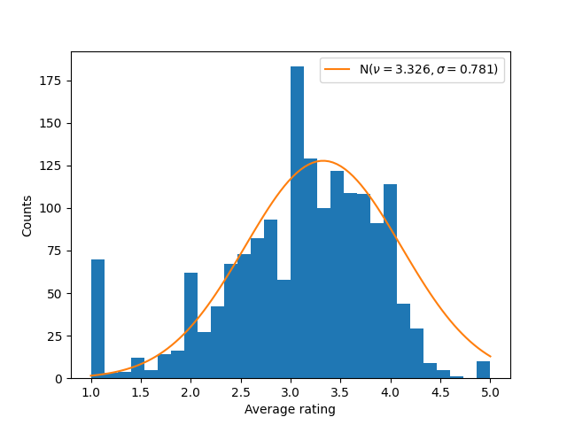
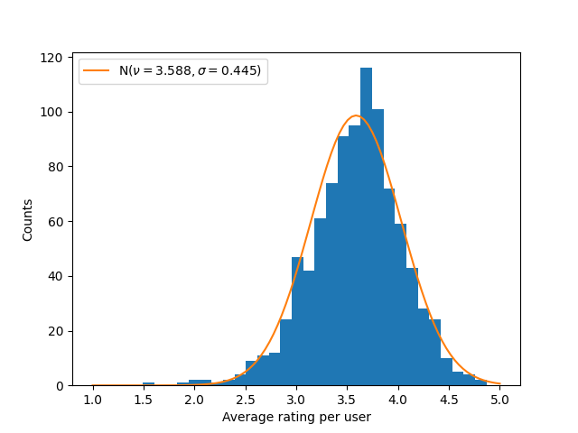
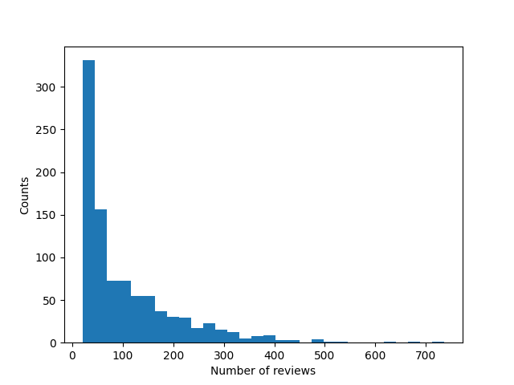

# Assignment #2: Recomendational systems
by Domrachev Ivan, B20-RO-01

## Introduction
The task for this assignment was to create a recommendational system for the movie suggestion. The given dataset is the `MovieLense-100k` -- famous dataset, containig information about 943 users and 1682 films.

First think to note is that it turns out that it's enough just to consider the ratings data to make a descent recommendation. Indeed, many State-of-the-art solutions for this dataset ([link](https://paperswithcode.com/sota/collaborative-filtering-on-movielens-100k)) rely only on the graph structure itself. Apparently, metadata starts to play an important role for much bigger chunks of data. 

Second think is that due to low dimensionality of data, the task could be reformulated as completion of rating matrix (i.e. weighted adjacency matrix). I find such implementation much more convinient to implement, so I'll mainly try to stick to it.

Therefore, the task is to *develop the Neural Network to complete the weighted adjacency matrix*.

## Data analysis
The given dataset is called `MovieLense-100k` and contains the data about 100k review from the 943 users about 1682 films. The metadata, such as film genres and year of publication is included as well (but mostly ommited in the prediction process).

Since the rating data plays the crutial part in the presented work, let's take a closer look at it. 

Firstly, let's review the distribution of the average rating reviews (Fig. 1). Notably, it is very well described by the shifted normal distribution. The shift could be explained by the outliers in the 1.0 rating.

<center>
    <figure>
    
    <figcaption>Figure 1. Distribution of average film rating. </figcaption>
    </figure>
</center>

Another place where one could observe normal distribution is in average rating *per person* (Fig. 2). Here, the data is almost perfectly described by the normal distribution with the same mean and variance as the given data. 

<center>
    <figure>
    
    <figcaption>Figure 2. Distribution of average film rating per person. </figcaption>
    </figure>
</center>

Finally, let's take a look at number of reviews per person (Fig. 3). Naturally, the majority of the people left a little bit more than 20 reviews with exponential decline with increased number of reviews.

<center>
    <figure>
    
    <figcaption>Figure 3. Distribution of amount of reviews per person. </figcaption>
    </figure>
</center>

To sum up, the dataset does not require any preprocessing, since the dataset has already been preprocessed by the authors. The analysis above confirms this point.

## Model Implementation
> Note: the work on the model is still in progress. Therefore, this chapter describes the model that intended to be a benchmark.

The model I decided to implement is "GLocal_K" model ([paper](https://arxiv.org/pdf/2108.12184.pdf)). The model is, in fact, autoencoder. However, the trick is in training the model: Firstly, an auto encoder is pretrained with the local kernelised weight matrix, which transforms the data from one space into the feature space by using a 2d-RBF kernel. Then, the pre-trained auto encoder is fine-tuned with the rating matrix, produced by a convolution-based global kernel, which captures the 
characteristics of each item. This results in quite decent performance (Fig. 4).

<center>
    <figure>
    
    <figcaption>Figure 4. The schematic overview of Glocal_K architecture (source: [paper](https://arxiv.org/pdf/2108.12184.pdf)). </figcaption>
    </figure>
</center>

## Model Advantages and Disadvantages
Advantages:
*  SOTA performance on the datasets "MovieLens-100k" and "MovieLens-1M"
*  Fast training process
*  Makes the recommendation for all users at once

Disadvantages:
* Bad scalability for bigger datasets: becomes very computationally expensive
* Unclear how to insert new users 

## Metrics
During the trainig

## Training Process
The training was performed using early stopping method based on the Root MSE metric. 

The pretraining took 29 epoches and exited with the following metrics:
```bash
------------------------------------------------------------
PRE-TRAINING
Epoch: 29
    Metric rmse: train -- 1.2377824783325195, test -- 1.2714707851409912
    Metric mae: train -- 0.99887615442276, test -- 1.0142855644226074
    Metric ndcg: train -- 0.8204927694952909, test -- 0.8239086080992291
------------------------------------------------------------

```  
The finetuning, on the other hand, took 318 epoches and converged at the following metrics:
```bash
------------------------------------------------------------
FINETUNING
Epoch: 318
    Metric rmse: 0.9084775447845459
    Metric mae: 0.8463990688323975
    Metric ndcg: 0.8993608548940443
------------------------------------------------------------

```  
During the finetuning stage, the weights were saved based on each of the metrics. All of them could be found [there](https://drive.google.com/drive/folders/1_uMUOMg1IBYFQdbtek-CVcc1ge-6R0GA?usp=sharing). 

## Evaluation & Results
The comparison of models, saved based on different metrics, showed that they are identical with each other (difference is < 0.01). Therefore, unfortunately, saving with different metrics does not helped a lot.

Nevertheless, the results (the evaluation obviously showed the same metircs as finetuning stage, since there was only train/validation partition) are comparable with SOTA solutions. Specifically, the weights presented on the [Google Drive](https://drive.google.com/drive/folders/1_uMUOMg1IBYFQdbtek-CVcc1ge-6R0GA?usp=sharing) could be placed on 8th place within [SOTA solutions](https://paperswithcode.com/sota/collaborative-filtering-on-movielens-100k).

In my opinion, this is quite a convincing result for a model, which was trained on the CPU on my laptop. 

## Appendix. Inference
I decided that looking at numbers is not very interesting, hence I designed a simple inference script. The user is asked to enter some information about himself. Then, the script finds a person in the dataset, who is the most similar to the user (by gender, occupation and minimal difference in age). Finally, it predicts what films this user might like, and then shows them to the user. 

All the information about running the inference could be found in the `README.md` file.